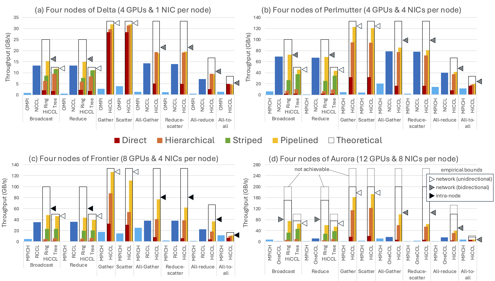

# HiCCL

HiCCL is a compositional communication library for hierarchical GPU networks. It offers an API for composing collective functions using *multicast*, *reduction*, and *fence* primitives. These primitives are machine- and library-agnostic, and are defined across GPU endpoints. HiCCL's design principle is to decouple the higher-level communication design and machine-specific optimizations. This principle aims to improve productivity, portability, and performance when building custom collective functions.

HiCCL is based on [CommBench](https://github.com/merthidayetoglu/CommBench): a micro-benchmarking software for HPC networks. While HiCCL is a C++ layer for generating communication patterns on an abstract machine, CommBench is the middleware for implementing the patterns on an actual machine. The implementation is achieved by using the point-to-point functions of the chosen communication library, MPI, NCCL, RCCL, and OneCCL, and IPC capability (put, get), and recently GASNet-EX for non-MPI applications.

For questions and support, please send an email to merth@stanford.edu
